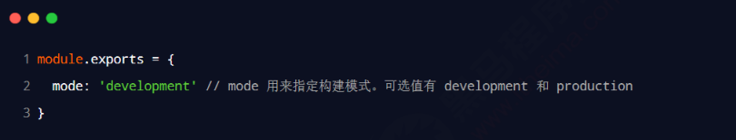
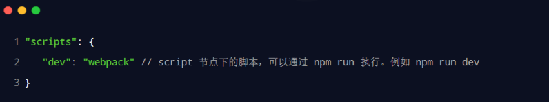
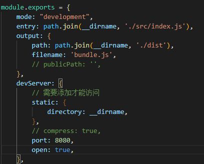
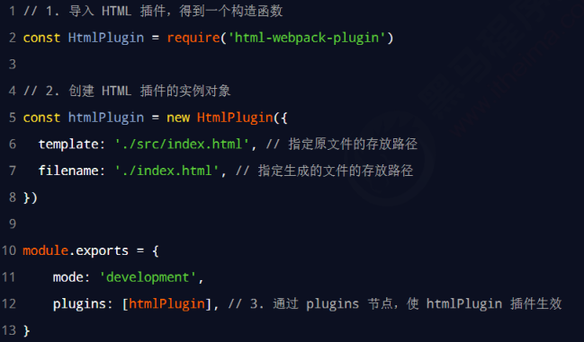
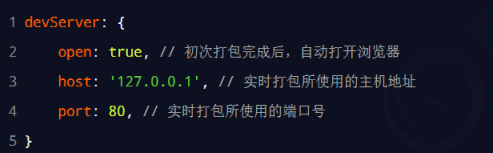
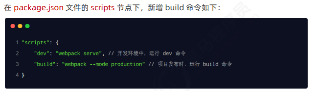
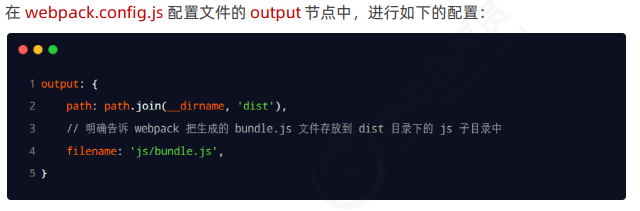
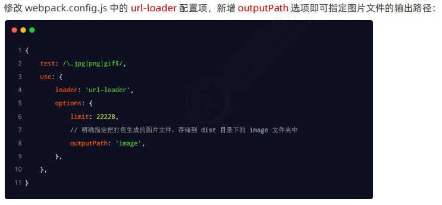
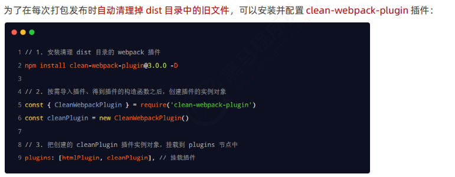

## Vue 2.0 学习

### 参考资料 
https://www.bilibili.com/video/BV1zq4y1p7ga?p=14&spm_id_from=pageDriver&vd_source=88e4bffc33a1ac3ec57e1b3c0320c0bf

### 学习记录（持续更新）
#### 2022.09.14 P01-P13
- 前端工程化：模块化、组件化、规范化、自动化
- 前端工程化解决方案：webpack，parcel
- webpack：代码压缩混淆、处理浏览器端兼容性、性能优化
- webpack使用
  - 安装：`npm i webpack webpack-cli -D`
  - 在根目录创建：`webpack.config.js`
   
  - 在 package.json 的 scripts 节点下，新增 dev 脚本如下：
   
  - 在终端中运行 npm run dev 命令，启动 webpack 进行项目的打包
  - mode有开发和生产两个环境
  - 默认从`src/index.js`打包到`dist/main.js`
  - 可以用entry修改打包对象，output修改输出路径

- webpack-dev-server插件：修改代码自动重新打包 
  - 安装
  - 修改 package.json -> scripts 中的 dev 命令如下：
   
  - 再次运行 npm run dev 命令，重新进行项目的打包
  - 在浏览器中访问 http://localhost:8080 地址，查看自动打包效果
  - 注：webpack-dev-server 会启动一个实时打包的 http 服务器
  - 注：生成的bundle.js在内存中，在根目录下/bundle.js

- html-webpack-plugin插件
  - 安装
  - 使用：在`webpack.config.js`导入`html-webpack-plugin`包->创造构造函数实例->写在`module.exports.plugin`中
   

- webpack.config.js的devServer节点配置
  

 #### 2022.09.15 P14-P31
- loader(插件大杂烩)
- css-loader：针对`import './css/index.css'`类似的es6语法
  - 安装：`npm i style-loader css-loader -D`
  - 在`webpack.config.js`中
  - ` module: {rules[/\.css$/, use:['style-loader', 'css-loader']]}`
  - 从后往前处理
- less-loader：针对`import './less/index.less'`类似的es6语法
  - 安装：`npm i less-loader less -D`
  - 在`webpack.config.js`中
  - ` module: {rules[/\.less$/, use:['style-loader', 'css-loader', 'less-loader']]}`
- url-loader：
  - 安装：`npm i file-loader url-loader -D`
  - 在`webpack.config.js`中
  - ` module: {rules[/\.jpg|png|gif$/, use:'url-loader&limt=22229']}`
  - 只有小于limit时，才会转为base64格式（减少服务器压力）
- babel-loader：
  - 安装：`npm i babel-loader @babel/core @babel/plugin-proposal-decorators -D`
  - 在`webpack.config.js`中
  - ` module: {rules[/\.js$/, use:'babel-loader', exclude:/node_modules/]}`
  - 新建babel.config.js文件
  - `module.exports = {
    "plugins": [["@babel/plugin-proposal-decorators", { "version": "legacy" }]]
}`

- 发布:build->优化路径->自动清理
   
   
   
   
  - 注：清理也可以用`output{clean:true}`