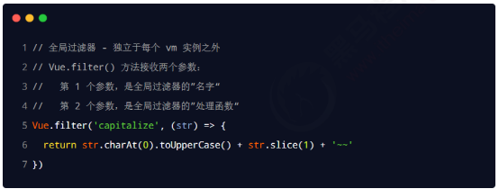
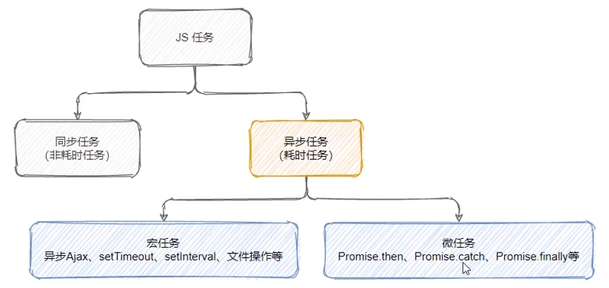
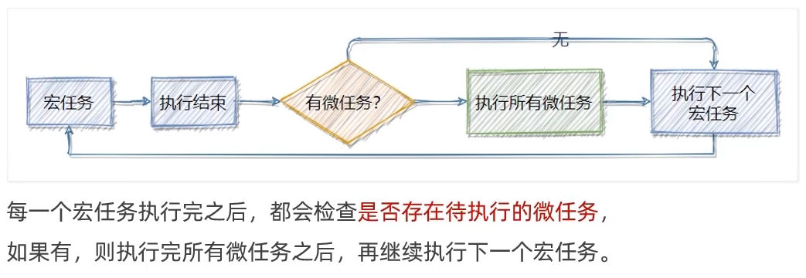

## Vue 2.0 学习

### 参考资料 
https://www.bilibili.com/video/BV1zq4y1p7ga?p=14&spm_id_from=pageDriver&vd_source=88e4bffc33a1ac3ec57e1b3c0320c0bf

### 学习记录（持续更新）
#### 2022.09.14 P01-P13
- 前端工程化：模块化、组件化、规范化、自动化
- 前端工程化解决方案：webpack，parcel
- webpack：代码压缩混淆、处理浏览器端兼容性、性能优化
- webpack使用
  - 安装：`npm i webpack webpack-cli -D`
  - 在根目录创建：`webpack.config.js`
   
  - 在 package.json 的 scripts 节点下，新增 dev 脚本如下：
   
  - 在终端中运行 npm run dev 命令，启动 webpack 进行项目的打包
  - mode有开发和生产两个环境
  - 默认从`src/index.js`打包到`dist/main.js`
  - 可以用entry修改打包对象，output修改输出路径

- webpack-dev-server插件：修改代码自动重新打包 
  - 安装
  - 修改 package.json -> scripts 中的 dev 命令如下：
   
  - 再次运行 npm run dev 命令，重新进行项目的打包
  - 在浏览器中访问 http://localhost:8080 地址，查看自动打包效果
  - 注：webpack-dev-server 会启动一个实时打包的 http 服务器
  - 注：生成的bundle.js在内存中，在根目录下/bundle.js

- html-webpack-plugin插件
  - 安装
  - 使用：在`webpack.config.js`导入`html-webpack-plugin`包->创造构造函数实例->写在`module.exports.plugin`中
   

- webpack.config.js的devServer节点配置
  

 #### 2022.09.15 P14-P31
- loader(插件大杂烩)
- css-loader：针对`import './css/index.css'`类似的es6语法
  - 安装：`npm i style-loader css-loader -D`
  - 在`webpack.config.js`中
  - ` module: {rules[/\.css$/, use:['style-loader', 'css-loader']]}`
  - 从后往前处理
- less-loader：针对`import './less/index.less'`类似的es6语法
  - 安装：`npm i less-loader less -D`
  - 在`webpack.config.js`中
  - ` module: {rules[/\.less$/, use:['style-loader', 'css-loader', 'less-loader']]}`
- url-loader：
  - 安装：`npm i file-loader url-loader -D`
  - 在`webpack.config.js`中
  - ` module: {rules[/\.jpg|png|gif$/, use:'url-loader&limt=22229']}`
  - 只有小于limit时，才会转为base64格式（减少服务器压力）
- babel-loader：
  - 安装：`npm i babel-loader @babel/core @babel/plugin-proposal-decorators -D`
  - 在`webpack.config.js`中
  - ` module: {rules[/\.js$/, use:'babel-loader', exclude:/node_modules/]}`
  - 新建babel.config.js文件
  - `module.exports = {
    "plugins": [["@babel/plugin-proposal-decorators", { "version": "legacy" }]]
    }`

- 发布:build->优化路径->自动清理
   
   
   
   
  - 注：清理也可以用`output{clean:true}`

#### 2022.09.16 P32-P51
- Vue使用
  - 导入vue库
  - 此时页面多了一个Vue构造函数
  - 渲染页面时可以直接调用数据名；绑定事件时可以直接调用方法
```js 
const vm = new Vue({
    el: '#app',
    data: {
        // 此处是数据
        username: 'zs',
        gender: '女',
        info: '<h4>1111</h4>',
        tips: '请输入用户名',
        index: 1,
        count: 1,
        city: '',
    },
    methods: {
        // 此处是方法
        add(n, e) {
            console.log(e);
            this.count += n;
        },
        clear(e) {
            // 修改事件触发对象用e.target
            e.target.value = '';
        }
    },
})
```

- 内容渲染指令
  - v-text：会覆盖元素内默认的值，并且不能渲染html
  - {{}}插值表达式
  - v-html：可以直接将带有标签的字符串渲染成html内容

- 属性渲染指令
  - v-bind：动态绑定属性值，可以简写为:，如`v-bind:placeholder`写为`:placeholder`
  - 注：插值表达式和属性渲染v-bind中均可以进行表达式的运算

- 事件绑定指令
  - `v-on:click=add(n)`或`@click=add(n)`   
  - 如果要用DOM中的事件对象，可以用`$event`传入实参
  - 事件修饰符： `@click.prevent=add(n)`：阻止默认行为
   
  - 案件修饰符：只有按键事件才有的
   

- 双向事件绑定：`v-model`，页面表单数据实时同步到vue中
  
  - 指令修饰符
   

#### 2022.09.17-18 P52-P74 P227-P257
- 条件渲染`v-if`/`v-show`
  - `v-if`是动态创建和删除，适合默认不用显示的场景
  - `v-show`是通过动态添加`style="display:none;"`属性来实现的，适合频繁切换的场景
  - `v-else-if`和`v-else`只能紧跟在`v-if`后面使用

- 循环渲染`v-for`
  - 数组循环：`<li v-for="(item, index) in items" :key="item.id">{{ item.message }}</li>`
  - 对象循环：`<div v-for="(value, name, index) in object">`
  - key值注意事项：
   
   
- 过滤器：用于文本格式化，只能用于v-bind和{{}}中
 
  - 私有：
   
  - 全局：
   
  - 如果全局和私有都定义了，以私有为准
  - 串联过滤器
  - 过滤器第一个参数是管道符前面的参数，若要传其他参数可以从第二个开始 

- 侦听器watch：监视数据的变化
  - 方法格式：
   
  - 对象格式：
    - 进入页面立即触发：
     
    - 监听对象属性的变化：
     
    - 只侦听某个子属性的变化：
     

- 计算属性computed，运算后的属性值
 
  - 声明时是一个方法，调用时采用属性方式调用
  - 只有依赖的数据发生变化时，计算属性才会变化

- ES6模板化
  - 默认导出`export default {n1, show}`
  - 按需导出`export const say = () => {}`
  - 导入：`import m1, { n3 as my_define, say } from './03-es6模块化.js';`
  - 直接导入并执行：`import './05-直接导入.js';`

- Promise：解决回调地狱的问题
  - Promise是构造函数，代表一个异步操作`const p = new Promise(function(resolve, reject){})`
  - Promise方式实现文件读取
    - 安装then-fs
    - 导入：`import thenFs from 'then-fs';`
    - 读取：
     
  - Promise.all方法，并行的异步操作，所有操作执行结束后执行then指令
   
  - Promise.race方法，谁先执行结束，就执行then指令
  - 封装自己的Promise读文件方法
   

- async/await：简化Promise操作
 
  - 在 async 方法中，第一个 await 之前的代码会同步执行，await 之后的代码会异步执行
  - 如果在 function 中使用了 await，则 function 必须被 async 修饰

- 同步异步任务
  - 执行示意图
   
  - 宏任务和微任务
   
   